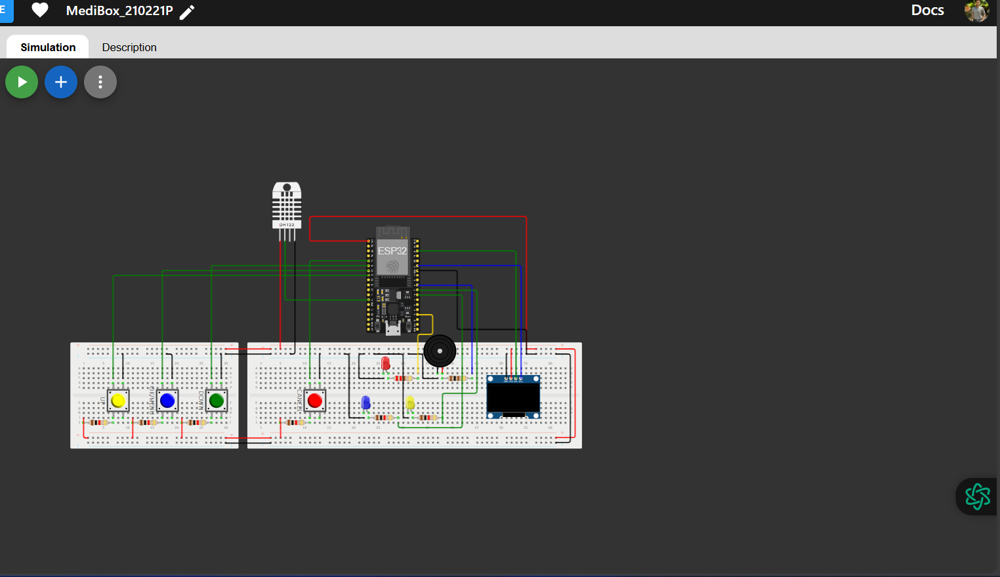
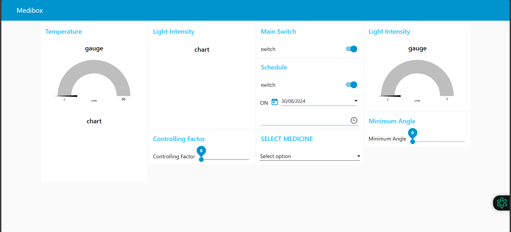

# Smart_Medi_Box_with_IOT
## Introduction
The Smart MediBox project aims to create an intelligent pharmaceutical storage system that efficiently manages medications. This documentation details the design, implementation, and features of the embedded software that drives the MediBox hardware.

## System Overview
The MediBox system integrates various hardware components such as an OLED screen, buzzer, push buttons, Light Dependent Resistors (LDRs), and a servo motor. The software includes embedded control, NTP time synchronization, alarm management, environmental monitoring, and a user interface for easy interaction.



## Functionalities

### Core Features
- **Time Synchronization**: Syncs time with an NTP server and allows time zone configuration.
- **Alarm Management**: Set, manage, and disable medication alarms.
- **Display Time**: Shows the current time on the OLED screen.
- **Alarm Notifications**: Provides audible and visual alerts; allows alarm dismissal via push buttons.
- **Environmental Monitoring**: Monitors temperature and humidity, issuing warnings for unhealthy levels.
- **Light Intensity Monitoring**: Uses LDRs to track light intensity and display data on the Node-RED dashboard.
- **Servo Motor Control**: Adjusts the shaded sliding window based on light levels and medicine-specific requirements.

### Advanced Features
- **Persistent Storage**: Stores alarms and user settings in non-volatile memory.
- **User-Friendly Interface**: Provides a menu-driven interface on the OLED screen for easy configuration.
- **Change Detection**: Minimizes power consumption by detecting sensor changes.
- **Continuous Monitoring**: Continuously monitors temperature, humidity, and light levels.

## Software Architecture

### Hardware Abstraction Layer
- Simplifies interactions with components like the OLED display, buzzer, buttons, LDRs, and servo motor.
- Abstracts hardware specifics for ease of development and future scalability.

### Sensor Management
- Handles data from the DHT sensor (temperature/humidity) and LDRs (light intensity).
- Processes and stores sensor data for monitoring and visualization on the Node-RED dashboard.

### Alarm Management
- Enables users to configure, disable, and manage alarms.
- Triggers the buzzer and displays alerts on the OLED screen when alarms go off.
- Stores alarm settings in non-volatile memory for persistence.

### Time Management
- Syncs system time with an NTP server for accuracy.
- Allows custom time zone configuration.
- Stores time zone settings in non-volatile memory.

### User Interface
- Provides a menu-driven OLED display for navigation and configuration.
- Allows alarm setup, time zone adjustments, and system status checks.
- Displays warnings when environmental conditions exceed thresholds.

### Communication Management
- Connects securely to an MQTT broker for remote data transmission and control.
- Publishes sensor data to MQTT topics for Node-RED dashboard visualization.
- Subscribes to topics for remote control of the servo motor, adjusting the shaded window.

This modular architecture ensures a clear separation of concerns, making the system maintainable and scalable for future enhancements.



## Hardware Components
The MediBox system requires the following hardware:

- **ESP32 Development Board**: The main controller with processing and connectivity capabilities.
- **OLED Display**: Displays time, alarm notifications, and system status.
- **Buzzer**: Provides audible alerts for medication reminders.
- **Push Buttons**: Enable user interaction for menu navigation and alarm management.
- **Light Dependent Resistors (LDRs)**: Measure ambient light intensity to control the shaded window.
- **Servo Motor**: Adjusts the shaded window based on light levels and user preferences.

> **Note**: Hardware changes will require corresponding configuration updates.

## Requirements

### Hardware
- ESP32 Development Board
- OLED Display
- Buzzer
- Push Buttons
- Light Dependent Resistors (LDRs)
- Servo Motor

### Software
- Wokwi
- Node-RED
- MQTT Broker
- VSCode

## Installation

### Hardware Setup
- Connect the components as detailed in the Port Map.

### Software Setup
1. Clone the repository:
    ```sh
    https://github.com/SamuDitha1
    ```
2. Set up the hardware as described [here](Hardware).
3. Open the Arduino IDE and upload the [sketch](Software/sketch02.ino).
4. Install Node-RED following the [official documentation](https://nodered.org/docs/getting-started/).
5. Import the Node-RED flow from the repository.
6. Run the Project:
    - Upload the firmware to the ESP32 board.
    - Start Node-RED with the command `node-red` in the terminal.
    - Open the Node-RED dashboard in your browser at `http://localhost:1880/ui`.

## Simulation
Set up the Wokwi simulator using the guide available [here](https://wokwi.com/dashboard/projects).
